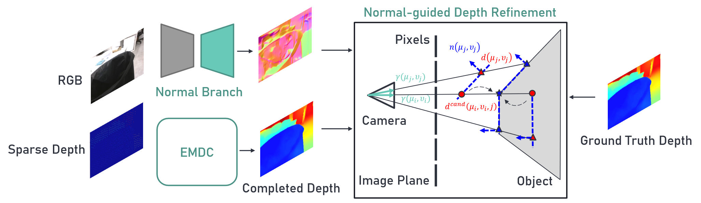

# Normal-guided depth candidates

 
 

    
     
     

## Overview
We proposed a depth completion method refined by leveraging surface normal estimation of neighboring pixels. In terms of target pixel, we remain the local neighbors depth consistence by projecting the predicted depth and ground truth depth of the neighboring pixels back to the target pixel through the surface normal vector.

